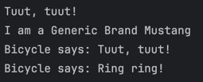

### Sample Output 1 Basic Inheritance: The extends Keyword:  

### Sample Output 2 Abstract Classes: Defining a Template  

### Sample Output 3 Method Overriding: Providing a New Implementation  

### Sample Output 4 Inheriting Variables & Access Rules  
